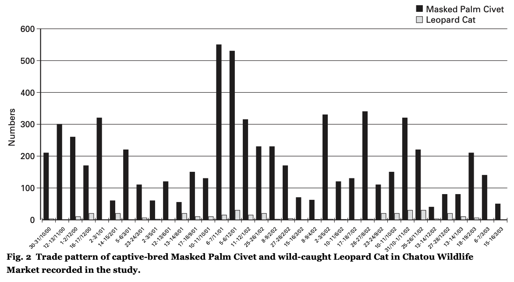
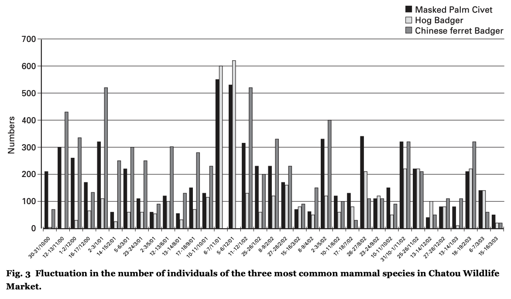

# Kadoorie farm &amp; Botanic garden 2004  

[Data](kadoorie_2004_Fig2-3.csv) from the 2004 report by Kadoorie farm &amp; Botanic garden

Reference: Kadoorie farm & Botanic garden, 2004. Wild Animal Trade Monitoring at Selected Markets in Guangzhou and Shenzhen, South China, 2000-2003. Kadoorie Farm & Botanic Garden Technical Report No.2. KFBG, Hong Kong SAR, 36 pp.

Available at <https://www.kfbg.org/images/download/Wild%20Animal%20Trade%20Monitoring%20in%20Selected%20Markets%20in%20Guangzhou%20and%20Shenzhen%2C%20South%20China%2C%202000-2003_ENG.pdf> (accessed 2025-08-08)

Comment in the report (p. 5):  
> There was a clear seasonal trend in which a lot more mammals (both wild-caught and captive-bred)
were available in the food market during the winter months from November to February (Figs. 2 & 3)  

Data from Figures 2 and 3, showing fluctuations in the sales of select species.  
  
  

The data were manually extracted with [WebPlotDigitizer](https://automeris.io).  
Missing bars were considered to be NAs, not 0.  
The resulting dataset is [here](kadoorie_2004_Fig2-3.csv). 
